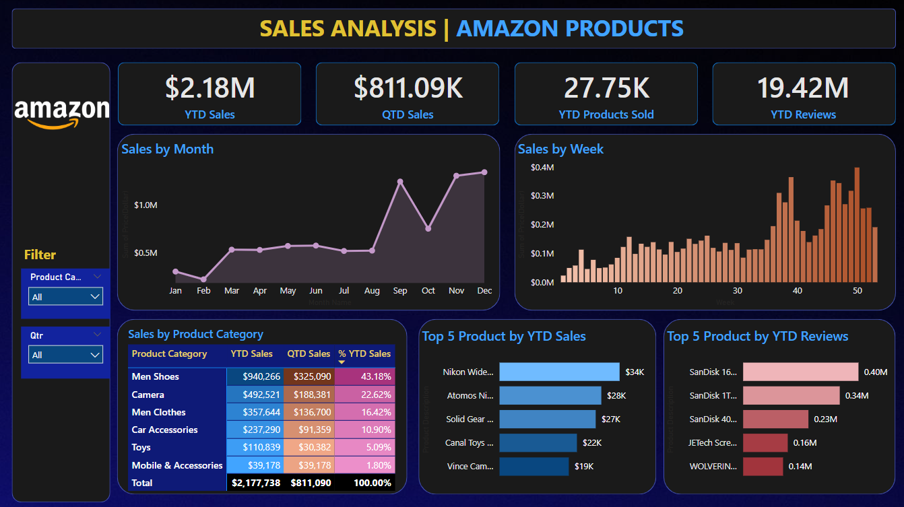

# 📊 Amazon Sales Analysis - Power BI Project

This Power BI project provides a comprehensive sales analysis of Amazon’s product data. It includes insights on revenue, profit trends, top-performing products, regions, and customer segments.

## 🧠 Objectives
- Understand overall sales performance.
- Identify top-selling categories and subcategories.
- Analyze monthly trends and regional sales.
- Provide actionable business insights.

## 📂 Files Included
- `Report.pbix` - The Power BI report file.
- `amazon_sales_data.xlsx` - The dataset used for the analysis.
- `dashboard_preview.png` - Preview of the dashboard.

## 🛠 Tools Used
- Microsoft Power BI
- Microsoft Excel
- Data Cleaning in Power Query

## 📈 Key Insights
- The highest revenue came from the **Electronics** category.
- **California** generated the most sales regionally.
- **December** saw the highest sales volume indicating holiday season peak.

## 📌 How to Use
1. Clone or download this repository.
2. Open `Report.pbix` in Power BI Desktop.
3. Connect to the dataset if needed and refresh the report.

---

## 📬 Contact
**Muzaffar Muzzu**  
📧 amrmuzaffar46@gmail.com  
🔗 [LinkedIn Profile](https://www.linkedin.com/in/muzaffar-muzzu-242b37323)

## 📸 Dashboard Preview

